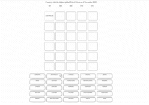
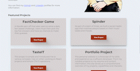

  
  
  

I’m passionate about sustainability and take inspiration from nature when building and refactoring elegant, efficient, and resilient systems. I want to continue working with diverse, passionate groups of people to improve the world we live in, one line of code at a time.

See [my website](https://onisemem.netlify.app/) for more information!

<h1 align="center">Projects</h1>
<table bordercolor="#66b2b2">
  
  <tr>
    <td width="50%" height="150px" valign="top">
      <h3 align="center">Factchecker Game</h3>
         
        
         
        

          
    
  
      

        
<strong>React.js, Sass, AWS, MongoDB, Serverless</strong> - FactChecker is a new Wordle spin-off I built that asks users to solve a daily fact based challenge. You should try it out &#128521;

    </td>
    <td width="50%" height="150px" valign="top">
      <h3 align="center">Spinder App</h3>
         
      
         
        

          
  
  
      

        
<strong>React.js, Node.js, Express, MongoDB</strong> - As part of a team of 3, we built Spinder to match people based on their music tastes and moods. We hope to help people connect through music. Still building more features &#128295;

    </td>
  </tr>
  
  <tr>
    <td width="50%" height="150px" valign="top">
      <h3 align="center">onis-emem.com</h3>
       
        
       
        

  
  
      

        
<strong>React.js</strong> - Portfolio Site including links to my projects, resume and ways to get in contact with me. You need a portfolio stater template? you can try this &#128640;

    </td>
    <td width="50%" height="150px" valign="top">
      <h3 align="center">Taste-IT</h3>
         
        
         
        

          
  
  
      

        
<strong>React.js</strong> - Supposed to be a regular coding exercise, but this app holds value in the use of simple and reusable component and custom hooks... valuable for reducing development time in many React.js projects.

    </td>
  </tr>
</table>

<h1 align="center">Technologies</h1>

    
    
    
    
    
    
    
    
    
    
    
    

---

<h1 align="center">Connect</h1>

  
  
  

