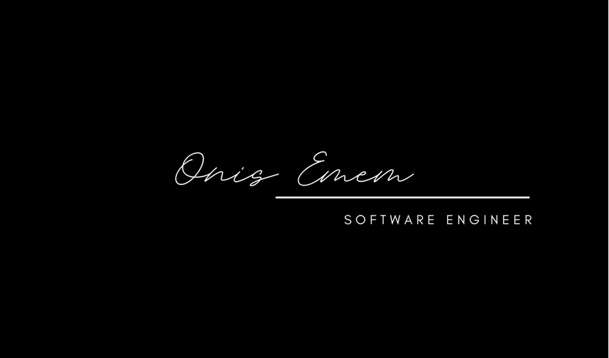

  
  
  
  

I’m passionate about sustainability and take inspiration from nature when building and refactoring elegant, efficient, and resilient systems. I want to continue working with diverse, passionate groups of people to improve the world we live in, one line of code at a time.

See my pinned repos and projects below or visit [my website](https://onisemem.netlify.app/) for more information!

<h1 align="center">Projects</h1>
<table bordercolor="#66b2b2">
  
  <tr>
    <td width="50%" valign="top">
      <h3 align="center">stylesconference.com</h3>
         
        
         
        

          
    
  
      

        
<strong>Javascript, CSS, HTML</strong> - Dedicated to the craft of building front-end application, Styles Conference gathers web developers to discuss new technologies.

    </td>
    <td width="50%" valign="top">
      <h3 align="center">NASA Planet Explorer: Mission Control</h3>
         
      
         
        

          
  
  
      

        
<strong>Javascript, Node.js, Express, MongoDB, Jest</strong> - NASA planet explorer mission control dashboard for scheduling rocket launches, aborting rocket launches, checking habitable planets in space, checking upcoming launches data and viewing historical rocket launches.

    </td>
  </tr>
  
  <tr>
    <td width="50%" valign="top">
      <h3 align="center">OnisEmem.com</h3>
       
        
       
        

  
  
      

        
<strong>HTML5, CSS3, & Javascript</strong> - Portfolio Site including links to my projects and ways to get in contact with me.

    </td>
    <td width="50%" valign="top">
      <h3 align="center">Movie Board</h3>
         
        
         
        

          
  
  
      

        
<strong>HTML5, CSS3, & Javascript</strong> - With over 100 different movie cards to preview! HTML & CSS is primarily used for styling the movie cards and the web design. The data of the movies, images, overview and rating is fetched from the TMDB API using JavaScript. Now you can checkout the latest movies and their rating!

    </td>
  </tr>
</table>

<h1 align="center">Technologies</h1>

    
    
    
    
    
    
    
    
    
    
    
    
    
    
    
    
    
    
    
    

---

<h1 align="center">Connect</h1>

  
  
  
  

